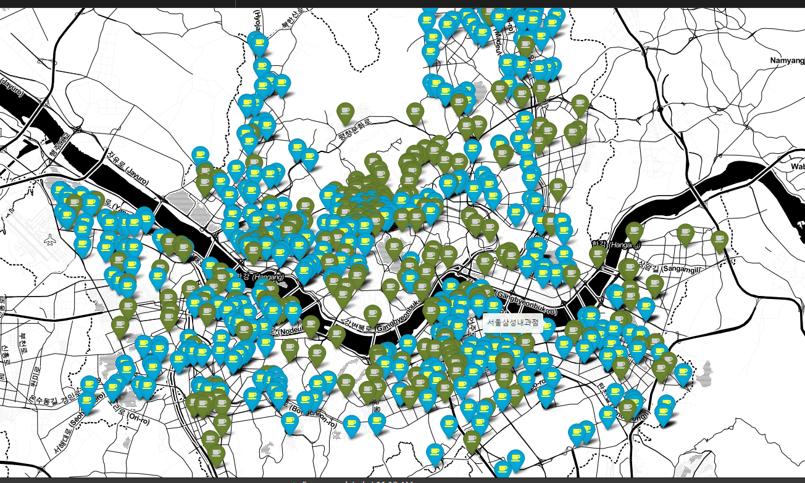

# Seoul-Coffee
서울시에 있는 이디야(EDIYA), 스타벅스(STARBUCKS) 매장 위치 분석
<br/><br/><br/>




## 개요
데이터 크롤링과 분석위주의 토이프로젝트.(토이 프로젝트라고 하기에는 조금 그렇지만...)<br/>
스타벅스 기프티콘을 받았는데, 집 앞에 있는 커피숍은 이디야여서 프로젝트를 진행하였습니다.<br/>
개연성이 떨어져 보이지만, 저의 의식의 흐름이였습니다..
<br/><br/><br/>


## 공부한 점
- 위도,경도 좌표를 얻기 위해서는 googlemaps라는 package를 임포트하고, google maps platform에 회원가입을 하는등 복잡한 작업을 해야했었는데, 새로운 방법을 터득했따.<br/>
```python
from geopy.geocoders import Nominatim
geo_local = Nominatim(user_agent='South Korea')
# 위도, 경도 반환하는 함수
def geocoding(address):
    geo = geo_local.geocode(address)
    # 첫번째가 위도, 두번째가 경도
    return geo.latitude, geo.longitude
```
- 데이터 수집은 selium과 BeautifulSoup을 이용했다.<br/>
  - 정적인 처리는 selium, html parsing은 BeautifulSoup을 이용했다.<br/><br/>

- 지도에 표시해주기 위해서 folium package를 사용해보았다.


<br/><br/><br/>


## 설명
- 제일먼저 `스타벅스와 이디야의 공식홈페이지` 들어가서 `매장찾기`에서 데이터를 수집했다.
- 수집한 데이터의 주소가 이상한 값들이 있어서, 처리를 해주었다.
  - 위도, 경도 값을 얻기위해서는 `정확한 도로명`주소가 필요했다.(지번 주소도 되는걸로 알고있습니다.)
  - 주소가 생략된 경우도 있었습니다.(drop 처리했습니다.)
- 데이터를 visualizaion을 진행하였습니다.<br/><br/>


<br/><br/><br/>

## Reference
<ul>
<li><a href="https://velog.io/@log327/Python-Selenium-Explicit-Waits-%EC%82%AC%EC%9A%A9%ED%95%98%EA%B8%B0" target="_blank">https://velog.io/@log327/Python-Selenium-Explicit-Waits-%EC%82%AC%EC%9A%A9%ED%95%98%EA%B8%B0</a></li>
<li><a href="https://www.youtube.com/watch?v=ay2VwNl_QMg&t=161s" target="_blank">https://www.youtube.com/watch?v=ay2VwNl_QMg&t=161s</a></li>
<li><a href="https://www.youtube.com/watch?v=qobe7k1CmGc" target="_blank">https://www.youtube.com/watch?v=qobe7k1CmGc</a></li>
<li></li>
</ul>
